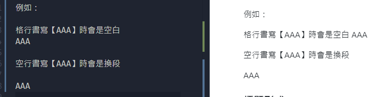
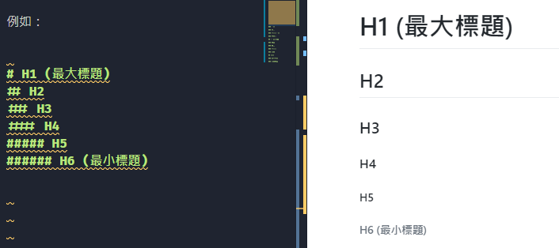
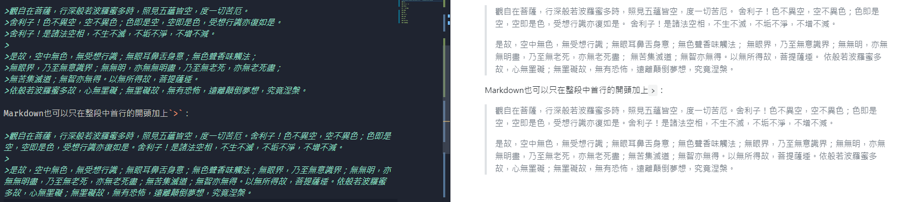
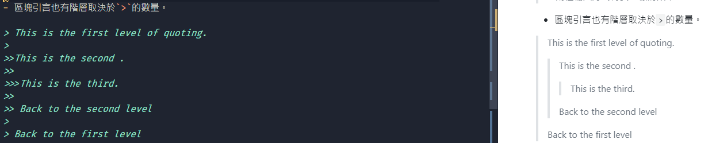
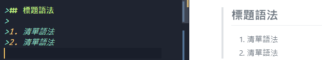
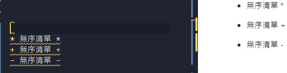

# 【Markdown學習筆記 - 基本語法】

基本內容

## -區塊-元素

### 段落與換行

段落由一個以上的句子組成。

  1. 在編寫時格行書寫顯示上為空一格，
  
  2. 空行則為換段。

例如：

### 標題形式

Markdown有兩種標題語法：Setext 與 atx。

Setext形式利用 **`= (最高階)`** 與 **`-(次階)`** 表示。

Atx形式下利用 **1~6個 `＃`** 來顯示不同等級的標題。文字後端的 `＃`數量 **僅排版用** 不影響大小。

>例如：
>

### 區塊引言

- Markdown的區塊引言與email相同，每行開頭加上`＞`看似強迫段行，也可只在整段首行的開頭加上`>`。

>例如：
>※兩種輸入方式得要一樣的效果

- 區塊引言也有階層取決於`>`的數量。

>例如：
>

- 區塊引言也可以使用其他語法，包刮標題、清單、程式碼區塊...ect。

>例如：
>

### 清單

Markdown支援 **有序清單** / **無序清單**。

>無序清單使用`*` `+` `-`作為標記：
>
>
>有序清單使用數字接`.`表示：
>

### 程式碼區塊

### 分隔線

## -區段-元素

### 連結

### 強調

### 程式碼

### 圖片

## 其他

### 跳脫字元

### 自動連結
