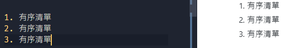

# 【Markdown學習筆記 - 基本語法】

基本內容

## -區塊-元素

### 段落與換行

段落由一個以上的句子組成。

  1. 在編寫時格行書寫顯示上為空一格，
  
  2. 空行則為換段。

例如：

### 標題形式

Markdown有兩種標題語法：Setext 與 atx。

Setext形式利用 **`= (最高階)`** 與 **`-(次階)`** 表示。

Atx形式下利用 **1~6個 `＃`** 來顯示不同等級的標題。文字後端的 `＃`數量 **僅排版用** 不影響大小。

>例如：
>

### 區塊引言

Markdown的區塊引言與email相同，每行開頭加上`＞`看似強迫段行，也可只在整段首行的開頭加上`>`。

>例如：
>※兩種輸入方式得要一樣的效果

區塊引言也有階層取決於`>`的數量。

>例如：
>

區塊引言也可以使用其他語法，包刮標題、清單、程式碼區塊...ect。

>例如：
>

### 清單

Markdown支援 **有序清單** / **無序清單**。

>無序清單使用`*` `+` `-`作為標記：
>
>
>
>有序清單使用數字接`.`表示：
>
>

---
## ~~待完成...~~

~~有序清單可以包含多個段落，每個項目需要一次縮排：~~
>例如

~~清單內搭配引言時，`>`需要縮排：~~
>例如：

~~清單內搭配程式碼區塊時，區塊需縮排兩次(8個空白鍵)。~~
>例如：

~~要避免在首行出現【數字-句號-空白】的組合，可以利用句號前加上反斜線修正。~~
>例如：

---

### 分隔線

一行中用三個 **`*`,`-`,`_`** 來建立分隔線，行內不能有任何東西。
>例如：

## -區段-元素

### 連結

- Markdown支援兩種連結語法：**行內** 和 **參考**，連結的文字皆需要 **`[方括號]`** 來標記。

  1. 行內形式：在 **`[]`** 後接上 **`()`** 及 **`網址連結`**，若在網址末端使用 **`"雙引號"`** 即可加上標題文。

  2. 參考形式：一個 **`[]`** 於連結文字的括號後方，第二個 **`[]`** 填入辨識連結的標籤。

- 連結定義的形式：

  1. **`[]`**：輸入連結的**辨識用標籤**
  2. **`：`**
  3.  一個空白鍵
  4.  連結的網址
  5.  **`＂Title"`**

### 強調

### 程式碼

### 圖片

## 其他

### 跳脫字元

### 自動連結
